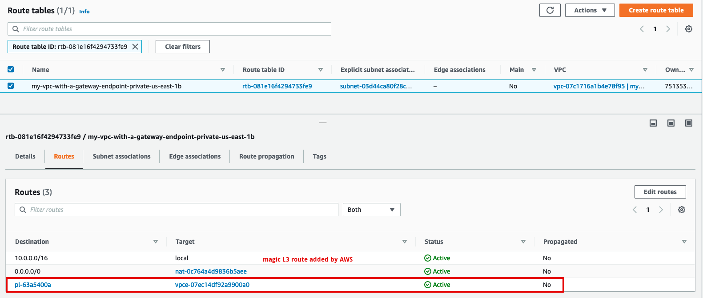

This scenario creates:

* 1 VPC with
  * 2 public subnets (empty)
  * 2 private subnets
  * 1 NAT gateway

* 1 VPC Endpoint of type Gateway, for S3

* An EC2 instance.

This is a standard networking setup in AWS. In this situation:

* All outbound traffic from the private subnets go through the (managed) NAT Gateway

* Outbound traffic to the S3 API is magically routed (at layer 3, through a route table) to S3. Consequently, traffic from the private subnets to the EC2 API stays on a private network and doesn't traverse neither the Internet, nor the NAT gateway.

## Walkthrough

### Deploy the scenario

```
terraform init
terraform apply
```

For next steps, make sure you have the [AWS SSM plugin](https://docs.aws.amazon.com/systems-manager/latest/userguide/session-manager-working-with-install-plugin.html) installed on your laptop (to allow for easy remote access).

### Access the virtual machine in the private network

As it's often the case, our virtual machine doesn't have a public IP. We can access it through AWS SSM:

```
aws ssm --region us-east-1 start-session --target i-xxxx
```

### Use the S3 API from the virtual machine

The instance role attached to our EC2 instance allows it to use `s3:Get*`, `s3:List*`, `s3:CreateBucket`.

```
$ aws s3 ls
```

### Understand how traffic is routed to S3 through the Gateway VPC endpoint

Notice that the S3 endpoint resolves to a **public** IP:


```
$ dig +short s3.us-east-1.amazonaws.com
52.216.137.54
```

This is because traffic routing happens at the IP layer (layer 3). Have a look at the route table attached to your private subnet:



This route is automatically added by AWS when you create the VPC endpoint of type Gateway. It "magically" routes any traffic going to a public IP corresponding to the S3 API through the backbone AWS network, making sure it doesn't leave the Internet.


### Fun with VPC endpoint policies

Recall the current situation:
* The instance role attached to our EC2 instance allows it to use `s3:Get*`, `s3:List*`, `s3:CreateBucket`.

* The policy applied to our VPC endpoint is:

```json
{
  "Version" : "2012-10-17",
  "Statement" : [
    {
      "Effect" : "Allow",
      "Principal" : "*",
      "Action" : ["s3:Put*", "s3:Get*", "s3:List*"],
      "Resource" : "*"
    }
  ]
}
```

Consequently, although our instance role has permissions to execute `s3:CreateBucket`, it will be blocked because the VPC endpoint policy (through which goes all our S3 API traffic) does not explicitly allow it:

```
$ aws s3api create-bucket --bucket foo
An error occurred (AccessDenied) when calling the CreateBucket operation: Access Denied
```

Conversely, although the VPC endpoint policy allows `s3:PutObject`, our instance role does not have this permission:

```
$ aws s3 ls | grep my-sample-s3-bucket
2022-05-25 15:06:05 my-sample-s3-bucket-dkkqxfzlabniefvm

$ aws s3 cp /etc/passwd s3://my-sample-s3-bucket-dkkqxfzlabniefvm
upload failed: ../../etc/passwd to s3://my-sample-s3-bucket-dkkqxfzlabniefvm/passwd An error occurred (AccessDenied) when calling the PutObject operation: Access Denied
```

Finally, since both the EC2 instance role *and* the VPC endpoint policy allow `s3:Get*`, we can for instance call `s3:GetBucketLocation`:

```
$ aws s3api get-bucket-acl --bucket my-sample-s3-bucket-dkkqxfzlabniefvm
{
    "Owner": {
        "DisplayName": "christophe.tafanidereeper",
        "ID": "ae6b2b60a0130196b53dfc671b529552605b0e9db2418cf63b9601815143cae4"
    },
    "Grants": [...]
}
```

### Destroy the scenario

Allow
```
terraform destroy
```

## Conclusions

**VPC Endpoint policies behave the same for Interface and Gateway VPC endpoints**

1. A permissive policy on a VPC endpoint policy of type Gateway **does not** create any security risk nor does it grant any unexpected permissions to any principal.

2. When an AWS API (here, S3) is accessed through a VPC endpoint of type Gateway, it uses the intersection of `policy attached to the principal` (here, instance role) and `policy attached to the endpoint` to determine the effective permissions.