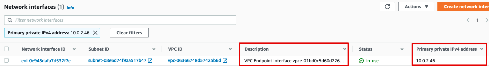

This scenario creates:

* 1 VPC with
  * 2 public subnets (empty)
  * 2 private subnets
  * 1 NAT gateway

* 1 VPC Endpoint interface for EC2

* An EC2 instance.

This is a standard networking setup in AWS. In this situation:

* All outbound traffic from the private subnets go through the (managed) NAT Gateway

* Outbound traffic to the EC2 API magically DNS-resolves to an AWS-managed private interface in the VPC. Consequently, traffic from the private subnets to the EC2 API stays on a private network and doesn't traverse neither the Internet, nor the NAT gateway.

## Walkthrough

### Deploy the scenario

```
terraform init
terraform apply
```

For next steps, make sure you have the [AWS SSM plugin](https://docs.aws.amazon.com/systems-manager/latest/userguide/session-manager-working-with-install-plugin.html) installed on your laptop (to allow for easy remote access).

### Access the virtual machine in the private network

As it's often the case, our virtual machine doesn't have a public IP. We can access it through AWS SSM:

```
aws ssm --region us-east-1 start-session --target i-xxxx
```

### Use the EC2 API from the virtual machine

The instance role attached to our EC2 instance allows it to use `ec2:Describe*` and `ec2:Stop*`.

```
$ aws ec2 describe-instances --region us-east-1
```

Notice how the EC2 API endpoint magically resolves to a *private* IP:

```
$ dig +short ec2.us-east-1.amazonaws.com
10.0.2.46
10.0.1.233
```

If you go to the [Network Interfaces](https://us-east-1.console.aws.amazon.com/ec2/v2/home?region=us-east-1#NIC:) page, you'll see this corresponds to the private IP of a network interface managed by AWS, and corresponding to our VPC endpoint for EC2:



**This confirms that any traffic going to the EC2 API goes through the VPC endpoint (private networking) instead of being routed through the internet**.

### Fun with VPC endpoint policies

The policy applied to our VPC endpoint is:

```json
{
    "Version" : "2012-10-17",
    "Statement" : [
      {
        "Effect" : "Allow",
        "Principal" : "*",
        "Action" : [
          "ec2:Create*",
          "ec2:Describe*"
        ],
        "Resource" : "*"
      }
    ]
  }
```

Consequently, although our instance role has permissions to execute `ec2:StopInstances`, it will be blocked because the VPC endpoint policy (through which goes all our EC2 API traffic) does not explicitly allow it:

```
ID=$(aws ec2 describe-instances --region us-east-1 --query 'Reservations[0].Instances[0].InstanceId' --output text)
aws ec2 stop-instances --instance-ids $ID --region us-east-1
```

> An error occurred (UnauthorizedOperation) when calling the StopInstances operation: You are not authorized to perform this operation.

Conversely, although the VPC endpoint policy allows `ec2:Create`, our instance role does not have this permission:

```
$ aws ec2 create-key-pair --key-name test --region us-east-1
An error occurred (UnauthorizedOperation) when calling the CreateKeyPair operation: You are not authorized to perform this operation.
```

### Destroy the scenario

```
terraform destroy
```

## Conclusions

1. A permissive policy on a VPC endpoint policy of type Interface **does not** create any security risk nor does it grant any unexpected permissions to any principal.

2. When an AWS API (here, EC2) is accessed through a VPC endpoint of type Interface, it uses the intersection of `policy attached to the principal` (here, instance role) and `policy attached to the endpoint` to determine the effective permissions.